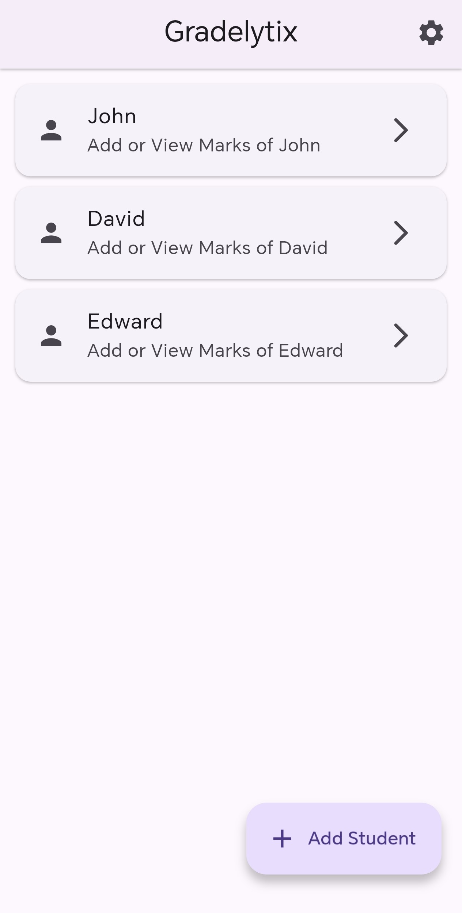
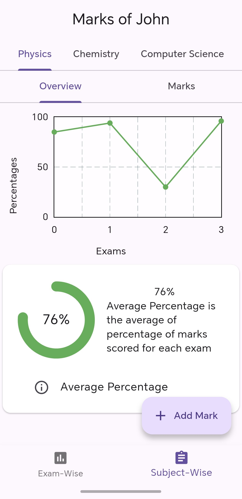
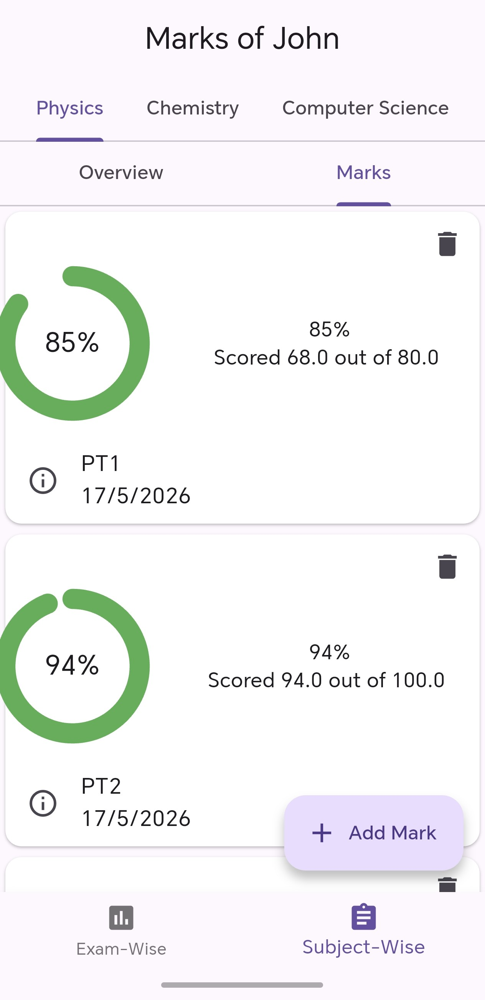
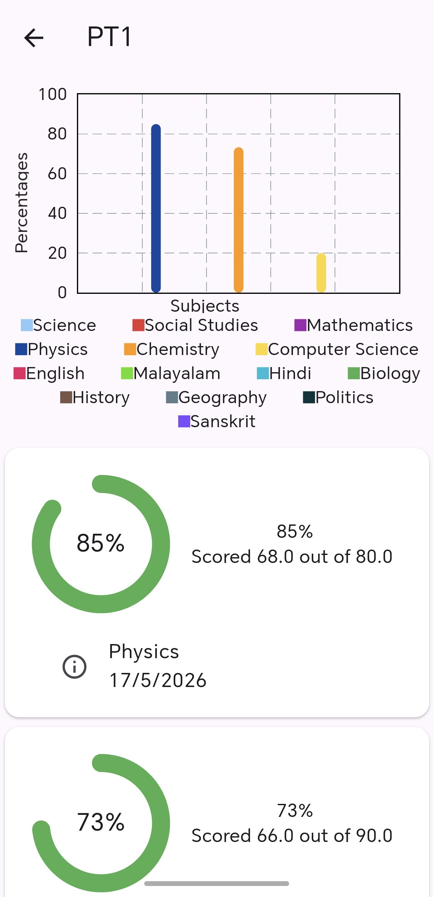

# Gradelytix

Gradelytix is a Flutter-based student mark management and analysis application developed as a project for CS50.

The application helps manage student academic records and provides simple visual analytics for performance tracking.

---

## Features

* Create and manage multiple student profiles
* Assign subjects for each student
* Add marks for different examinations

  * Examples:

    * PT1
    * PT2
    * Final Exam
* View:

  * Exam-wise marks
  * Subject-wise percentage
  * Overall percentage
* Performance visualization using:

  * Line graphs
  * Bar graphs

---

## About the Project

Gradelytix was created to explore:

* Flutter application development
* Data handling
* UI design
* Graph and chart visualization
* Multi-screen navigation

The project focuses on keeping the workflow simple and lightweight while still providing useful academic analysis features.

---

## Known Issues

* Some Android navigation behavior is inconsistent.
* In certain cases, returning to the previous screen may not work correctly.
* Minor UI and navigation bugs may still exist.

---

## Screenshots

  
  
  
  

---

## Tech Stack

* Flutter
* Dart
* Material Design

---

## Author

Developed by **Arshal Aromal**.
